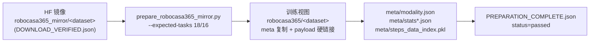

# RoboCasa365 数据与训练就绪检查

检查日期：2026-10-07。

**结论：`playground/Datasets/robocasa365/` 已是训练就绪视图，无需重新准备或下载。**
`preparation_status.json` 与 `environment_status.json` 均为完成态，数据加载器已实测可读。

> 本文只覆盖 **RoboCasa365（官方 robocasa 仓库 / PandaOmron 单臂 Franka）**，
> 即 [`examples/Robocasa_365`](../examples/Robocasa_365)。
> 另一条 GR1 tabletop 路线见文末“与其他 RoboCasa 路线的关系”。

---

## 1. 数据位置

| 用途 | 路径 | 大小 |
| --- | --- | --- |
| **训练视图（直接使用）** | `playground/Datasets/robocasa365/<dataset>/` | 5.9G + 17G + 19G ≈ 41G |
| 原始 HF 镜像（保留） | `playground/Datasets/robocasa365_mirror/<dataset>/` | 5.9G + 17G + 19G ≈ 41G |
| 厨房/物体资产 | `playground/Datasets/robocasa365_mirror/Robocasa365-Assets/` | 11G |
| 仿真器源码 | `playground/Code/robocasa365`、`playground/Code/robosuite-robocasa365` | — |
| 准备元数据/日志 | `.cache/robocasa_setup/` | — |

训练视图是镜像的**无损派生**：`meta/` 为复制，`data/*.parquet` 与 `videos/*.mp4`
载荷用 **硬链接** 复用（已确认 `file-000.mp4` 两目录 inode 相同 `62661177`），因此
删除镜像目录可回收 41G，不影响训练视图。

---

## 2. 数据清单

三个数据集均为 LeRobot **v3.0**，`20 fps`，3 路物理相机 256×256。

| 数据集 | 分组 | 任务数 | Episodes | 帧 | Revision |
| --- | --- | ---: | ---: | ---: | --- |
| `robocasa365-target-atomic` | atomic | 18 | 9,126 | 2,231,347 | `ee95cbe19134` |
| `robocasa365-target-composite-seen` | composite | 16 | 8,077 | 6,002,265 | `d431cfc244ec` |
| `robocasa365-target-composite-unseen` | composite | 16 | 8,104 | 6,724,287 | `33f25a67c1a3` |
| **合计** | | **50** | **25,307** | **14,957,899** | |

- 来源：HuggingFace `ember-lab-berkeley/robocasa365-target-{atomic,composite-seen,composite-unseen}`、
  `twilighted/Robocasa365-Assets`。
- 模态：`observation.state`(16d)、`action`(12d)、3 路视频
  （`robot0_agentview_left` / `robot0_agentview_right` / `robot0_eye_in_hand`）、
  `annotation.human.task_description`(语言)。
- 未来帧离线偏移：`[0, 8, 16]` 帧 = `[0.0, 0.4, 0.8] s`（GAWM 未来预测用）。

### 任务清单

**atomic（18）**：CloseBlenderLid, CloseFridge, CloseToasterOvenDoor, CoffeeSetupMug,
NavigateKitchen, OpenCabinet, OpenDrawer, OpenStandMixerHead, PickPlaceCounterToCabinet,
PickPlaceCounterToStove, PickPlaceDrawerToCounter, PickPlaceSinkToCounter,
PickPlaceToasterToCounter, SlideDishwasherRack, TurnOffStove, TurnOnElectricKettle,
TurnOnMicrowave, TurnOnSinkFaucet

**composite-seen（16）**：DeliverStraw, GetToastedBread, KettleBoiling, LoadDishwasher,
PackIdenticalLunches, PreSoakPan, PrepareCoffee, RinseSinkBasin, ScrubCuttingBoard,
SearingMeat, SetUpCuttingStation, StackBowlsCabinet, SteamInMicrowave, StirVegetables,
StoreLeftoversInBowl, WashLettuce

**composite-unseen（16）**：ArrangeBreadBasket, ArrangeTea, BreadSelection,
CategorizeCondiments, CuttingToolSelection, GarnishPancake, GatherTableware,
HeatKebabSandwich, MakeIceLemonade, PanTransfer, PortionHotDogs, RecycleBottlesByType,
SeparateFreezerRack, WaffleReheat, WashFruitColander, WeighIngredients

> `unseen` 仅指官方**评测**任务划分，其数据**仍用于训练**（三个数据集全部进训练 mixture）。

---

## 3. 数据管线



生成脚本：[`scripts/prepare_robocasa365_mirror.py`](../scripts/prepare_robocasa365_mirror.py)
（`--source` 镜像 / `--destination` 训练视图 / `--assets` 资产解压）。
编排脚本：`.cache/robocasa_setup/finish_preparation.py`（等待下载 → 审计 → 资产冒烟 → 汇总）。

---

## 4. 已执行的核验

### 4.1 下载完整性
- `download_status.json`：`status=download_verified`，
  **54,240,276,711 字节 / 321 文件** 全部校验通过，24 并发，6 次重试后完成。
- `audit_20261005/inventory.json` 逐仓库比对期望字节数与文件数。

### 4.2 训练视图审计（每个数据集）
`PREPARATION_COMPLETE.json` 记录：`status=passed`，
- episode 数与 `meta/info.json` 的 `total_episodes`/`total_frames` 一致；
- `frame_index` 连续、`timestamp` 与 20fps 吻合；
- action(12d)/state(16d) 形状正确且全部有限；
- 逐 episode 的视频坐标与实际 `videos/*.mp4` 流一致；
- 语言指令非空且可映射到 `tasks.parquet`；
- `video_reencoded=false`（视频未经重编码）、`raw_snapshots_unchanged=true`。
- 每任务抽样一条 episode 复查语言描述（atomic 18 条，见该 json `sample_checks`）。

### 4.3 单元/接口测试
```
.venv/bin/python -m pytest tests/test_robocasa365_preparation.py \
                            tests/test_robocasa365_interface.py -q
# -> 5 passed
```

### 4.4 加载器冒烟测试（2026-10-07 实测）
用训练配置直接构建数据集：

```
mixture  = robocasa365_target50_mirror_wm
len      = 20,172,861 steps
子集长度  = [2,231,347  6,002,265  6,724,287]
构建耗时  = 2.1 s
样本字段  = action / state / image(3) / future_images(2) / lang / view_valid_mask /
           action_valid_mask / future_frame_valid_mask / control_hz=20.0 /
           action_spec_id=panda_omron_eef_delta_base_mode_12 /
           state_spec_id=panda_omron_base_eef_quaternion_gripper_16
```

### 4.5 环境与厨房仿真
- `environment_status.json`：`data_training_ready=true`、`package_dependency_check=passed: 143 packages`、
  `mujoco_cpu_render_and_step_passed=true`、`full_kitchen_rollout_test=passed_cpu_smoke`。
- robocasa gym 注册任务数 **396**；资产跨镜像 SHA256 与 IIFAN 镜像一致。

---

## 5. 训练环境

`environment_status.json` 记录：

| 组件 | 版本 |
| --- | --- |
| Python | 3.10.12 |
| robocasa | 1.0.1（commit `456174f619`…） |
| robosuite | 1.5.2（commit `5ce6643f`…） |
| mujoco | 3.3.1 |
| lerobot | 0.3.3 |
| numpy / numba | 2.2.5 / 0.61.2 |
| torch | 2.7.1 |

- 训练器：仓库自带 `.venv`（`starVLA`）。
- 仿真器：独立环境 `.venv-robocasa`，通过 `.cache/robocasa_setup/env.sh` 激活
  （`MUJOCO_GL=osmesa`、`PYOPENGL_PLATFORM=osmesa`、`HF_ENDPOINT=hf-mirror.com`；CPU 渲染是有意为之）。

---

## 6. 直接使用的配置

数据配置：[`examples/Robocasa_365/train_files/robocasa365_target50_data.yaml`](../examples/Robocasa_365/train_files/robocasa365_target50_data.yaml)

```yaml
datasets:
  vla_data:
    data_root_dir: playground/Datasets/robocasa365
    data_mix: robocasa365_target50_mirror_wm
    lerobot_version: v3.0
    action_mode: abs            # 保留存储的命令，不再对 EEF delta 做差分
    include_state: true
    future_obs_frames: true
    target_num_views: 3
    strict_camera_views: true
    video_backend: torchvision_av
    obs_image_size: [256, 256]
```

数据注册：[`examples/Robocasa_365/train_files/data_registry/data_config.py`](../examples/Robocasa_365/train_files/data_registry/data_config.py)
（`PandaOmronRoboCasa365MirrorWMDataConfig`，`embodiment_tag=NEW_EMBODIMENT`）。

可用 mixture：

| mixture | 内容 |
| --- | --- |
| `robocasa365_open_drawer_target_human` | 仅 OpenDrawer（冒烟） |
| `robocasa365_atomic_target_human_all` | 18 atomic |
| `robocasa365_composite_target_human_all` | 32 composite |
| `robocasa365_target_human_all` | 50 任务 |
| **`robocasa365_target50_mirror_wm`** | 3 个已验证 v3 镜像（**推荐，本报告验证的路径**） |

全量训练入口：[`examples/Robocasa_365/train_files/run_robocasa365_all.sh`](../examples/Robocasa_365/train_files/run_robocasa365_all.sh)

---

## 7. 注意事项

1. `action_mode=abs` 表示**保留存储命令**，不要再对 EEF delta 做差分；存储顺序为
   `base4,mode1,eef_position3,eef_rotation3,gripper1`，模型侧顺序为
   `eef_position3,eef_rotation3,gripper1,base4,mode1`（准备阶段已重排）。
2. 归一化统计由**全部训练帧**计算（`meta/stats.json` / `stats_gr00t.json`）。
3. 训练视图 payload 与镜像是硬链接：**不要就地改写**训练视图的 parquet/mp4，
   否则会同时影响镜像。
4. `.cache/robocasa_setup/preparation.log` 中的 `Download failed` 是**过期**的早期
   失败记录（下载重试 6 次后成功）；以 `download_status.json` / `preparation_status.json` 为准。
5. 本机目前**没有** RoboCasa365 checkpoint（`playground/Checkpoints/` 中无）。

---

## 8. 与其他 RoboCasa 路线的关系

| 路线 | 目录 | 数据 |
| --- | --- | --- |
| **RoboCasa365**（官方，PandaOmron） | `examples/Robocasa_365` | **本报告**，本机已就绪 |
| Robocasa-GR1-Tabletop（Nvidia fork） | `examples/Robocasa_tabletop` | 使用 NVIDIA `PhysicalAI-Robotics-GR00T-X-Embodiment-Sim`（mixture `fourier_gr1_unified_1000`，robot_tag `fourier_gr1_arms_waist`）；**本机 `playground/Datasets/` 下不存在该数据集** |

两条路线**刻意分离**，数据格式与 embodiment 均不同，不可混用。

---

## 9. 证据文件

| 文件 | 内容 |
| --- | --- |
| `.cache/robocasa_setup/preparation_status.json` | 总状态（`status=complete`，50 任务 / 25,307 episodes / 14,957,899 帧） |
| `.cache/robocasa_setup/environment_status.json` | 环境与就绪标志 |
| `.cache/robocasa_setup/download_status.json` | 下载校验（54,240,276,711 B / 321 文件） |
| `.cache/robocasa_setup/audit_20261005/inventory.json` | 逐仓库文件/字节审计 |
| `playground/Datasets/robocasa365/<dataset>/PREPARATION_COMPLETE.json` | 逐数据集审计结果 |
| `playground/Datasets/robocasa365_mirror/<dataset>/DOWNLOAD_VERIFIED.json` | 镜像下载校验标记 |
| `tests/test_robocasa365_preparation.py`、`tests/test_robocasa365_interface.py` | 接口与准备测试（5 passed） |

## 10. 参考

- RoboCasa365 走查：[`examples/Robocasa_365/README.md`](../examples/Robocasa_365/README.md)
- 上游仓库：<https://github.com/robocasa/robocasa>
- 数据集：HuggingFace `ember-lab-berkeley/robocasa365-*`、`twilighted/Robocasa365-Assets`
